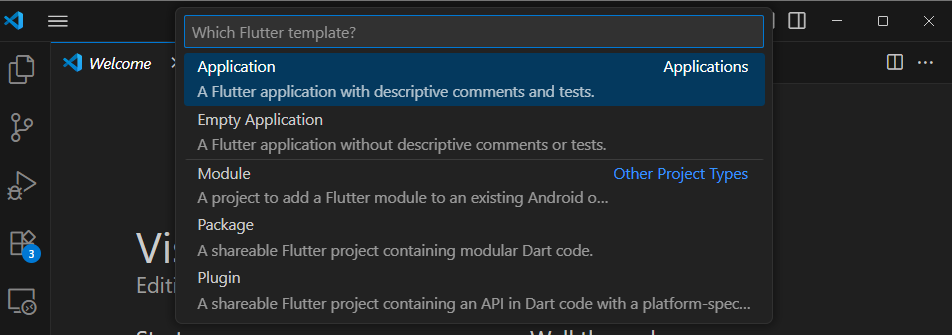
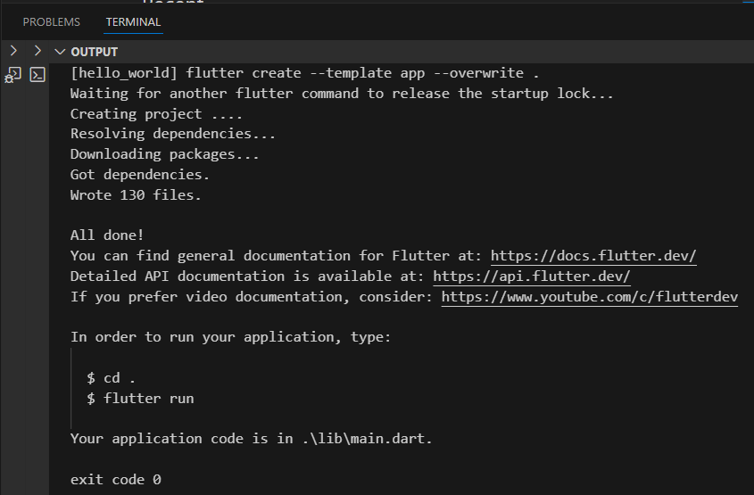

 # *Praktikum 1: Membuat Project Flutter Baru*
## **Step 1 & 2**

### **Explanation :**
#### Result:
To create a new Flutter project in VS Code, press Ctrl + Shift + P (or go to View > Command Palette), type “Flutter”, and select “Flutter: New Application Project”. Then, create a folder following the format of your practicum report, preferably in a location like Documents, Desktop, or another directory that is not too deep or complex, and choose Select a folder to create the project in. After that, enter a name for your project, and VS Code will automatically create and open it. Make sure the Flutter SDK and Flutter extension are already installed in VS Code.

## **Step 3**

### **Explanation :**
#### Result:
Name the Flutter project hello_world, press Enter, and wait for the process to finish. The name must be all lowercase, without spaces, and can use underscores. It can't start with a number or special character. This is just the project name, not the app name shown in stores.

## **Step 4**

### **Explanation :**
#### Result:
Once the project creation is complete, make sure the screen displays the message "Your Flutter project is ready!", which means you have successfully created a new Flutter project.

 # *Praktikum 2: Menghubungkan Perangkat Android atau Emulator*
## **Step 1 & 2**

### **Explanation :**
#### Result: