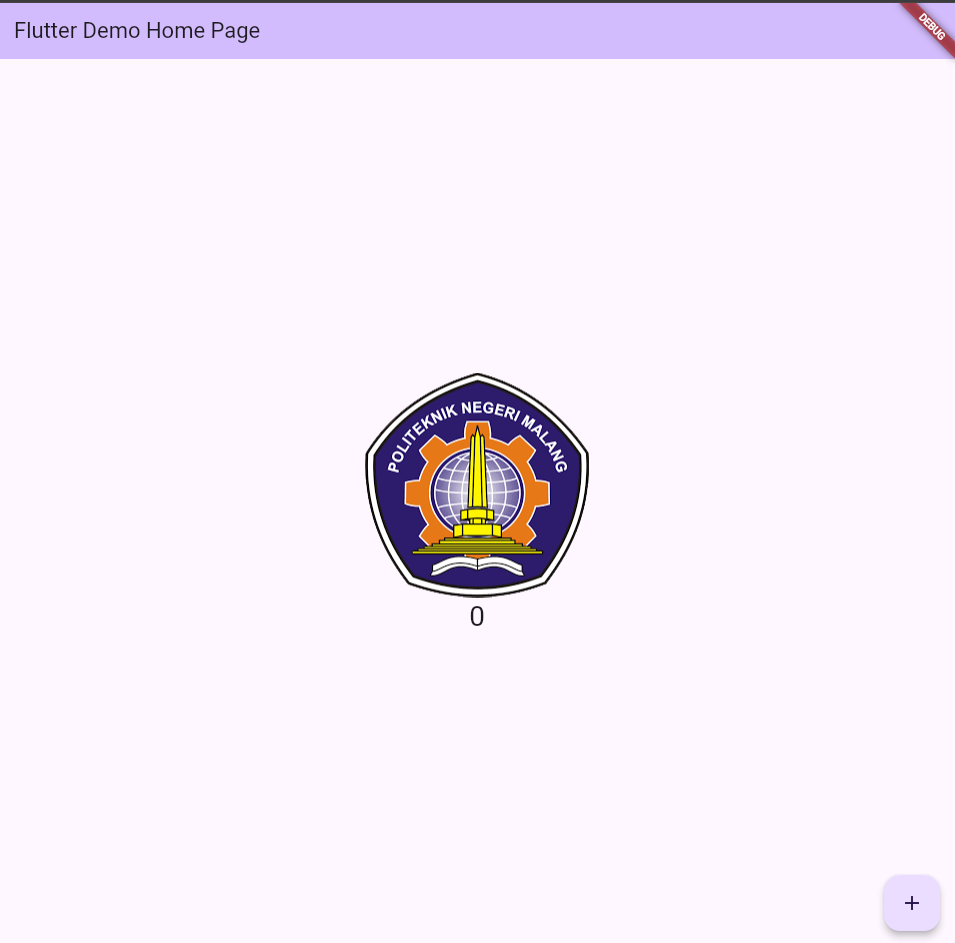

 # *Praktikum 1: Membuat Project Flutter Baru*
## **Step 1 & 2**

### **Explanation :**
#### Result:
To create a new Flutter project in VS Code, press Ctrl + Shift + P (or go to View > Command Palette), type “Flutter”, and select “Flutter: New Application Project”. Then, create a folder following the format of your practicum report, preferably in a location like Documents, Desktop, or another directory that is not too deep or complex, and choose Select a folder to create the project in. After that, enter a name for your project, and VS Code will automatically create and open it. Make sure the Flutter SDK and Flutter extension are already installed in VS Code.

## **Step 3**

### **Explanation :**
#### Result:
Name the Flutter project hello_world, press Enter, and wait for the process to finish. The name must be all lowercase, without spaces, and can use underscores. It can't start with a number or special character. This is just the project name, not the app name shown in stores.

## **Step 4**

### **Explanation :**
#### Result:
Once the project creation is complete, make sure the screen displays the message "Your Flutter project is ready!", which means you have successfully created a new Flutter project.

 # *Praktikum 2: Menghubungkan Perangkat Android atau Emulator*
## **Running the Application on an Android Device Using a USB Cable**

### **Explanation :**
#### Result:
After successfully connecting the Android device to the computer via a USB data cable, enabling Developer Options and USB Debugging on the phone, and granting ADB permission when prompted, Android Studio detected the device and allowed the app to be deployed. By clicking the ▶️ Run button, the Flutter project was compiled and installed directly onto the phone in debug mode. This method allows for fast and stable data transfer, enabling developers to monitor logs in real time, perform hot reloads, and test the app efficiently. No internet connection is required as long as the USB cable and device drivers are functioning properly.

## **Running the Application on an Android Device Using Wi-Fi**

### **Explanation :**
#### Result:
After enabling Wireless Debugging on the Android device and ensuring both the computer and phone are connected to the same Wi-Fi network, the pairing process was initiated using Android Studio's “Pair Devices Using Wi-Fi” feature. The device was successfully connected either by scanning a QR code or entering a pairing code. Once connected, Android Studio recognized the device over the network, allowing the Flutter app to be compiled and deployed wirelessly. Although slightly slower than USB deployment, this method is highly convenient, especially when cables are unavailable or when the device needs to remain physically unconnected. The wireless connection remains stable as long as the devices stay on the same network.

# *Praktikum 3: Membuat Repository GitHub dan Laporan Praktikum*

## **Step 1-10**

### **Explanation :**
#### Result:
In steps 1 to 10, the process involved setting up Git version control for a Flutter project and connecting it to a GitHub repository. After logging into GitHub and creating a new repository named flutter-fundamental-part1, the Flutter project folder (hello_world) was initialized using git init. The .gitignore file was staged and committed first, followed by other essential files like README.md and the full project structure using the "Stage All Changes" option. A remote named origin was added with the repository URL from GitHub, allowing push operations to be performed. A personal access token was used for authentication during the first push. The result of these steps was a fully version-controlled project, properly linked with GitHub, where all files were pushed and visible on the repository page with commit messages like "tambah gitignore" and "project hello_world".

## **Step 1-10**

### **Explanation :**
#### Result:
In steps 11 and 12, the focus shifted to running the Flutter project and preparing evidence for the practical report. The Flutter app was executed either on a physical device, emulator, or browser by selecting the appropriate target platform in the lower-right corner of VS Code and using the F5 shortcut or the "Start Debugging" option. After the build process completed, the app displayed a simple interface with a counter, and the text was updated to show the student's full name. A screenshot of this result was taken and saved as 01.png in a newly created images/ folder within the project. Then, the README.md file was updated to include the screenshot as proof of completion, and all changes were committed and pushed to GitHub. This step ensured both functional validation of the app and proper documentation for the practical submission.

# *Praktikum 4: Menerapkan Widget Dasar*

## **Step 1**

### **Explanation :**
#### Result:
In this step, a new folder named basic_widgets was created inside the lib directory of the hello_world project, followed by the creation of a Dart file named text_widget.dart. This file defined a custom StatelessWidget called MyTextWidget, which displayed a red-colored text message using the Text widget. The default placeholder "Fulan" was replaced with the student’s full name to personalize the message. Afterward, the MyTextWidget component was imported and used inside the main.dart file, replacing the existing text widget. When the app was executed, it displayed the updated message centered on the screen. A screenshot of the result was taken and included in the README.md as part of the practical report documentation.

## **Step 1**

### **Explanation :**
#### Result:
The second step involved creating a new Dart file named image_widget.dart within the same basic_widgets folder. This file introduced another StatelessWidget called MyImageWidget, which rendered an image using the Image widget and loaded it from local assets. The image file logo_polinema.jpg was added to the project’s root directory, and the path was registered under the flutter/assets section of the pubspec.yaml file. After saving and running flutter pub get, the asset became accessible. The main app was then updated to import and use MyImageWidget, and upon execution, the image appeared correctly on the screen. This result was also captured in a screenshot and documented in the project’s README.md file.

# *Praktikum 5: Menerapkan Widget Material Design dan iOS Cupertino*

## **Step 1**

### **Explanation :**
#### Result:
In this step, a new file named loading_cupertino.dart was created inside the basic_widgets folder. The widget used a combination of MaterialApp and Cupertino components such as CupertinoButton and CupertinoActivityIndicator. This demonstrated Flutter’s flexibility in mixing iOS-style widgets within a standard Flutter app. The UI displayed a simple button labeled "Contoh button" and a loading spinner below it. The file was then imported into main.dart, and a screenshot of the result was taken to be included in the report documentation.

## **Step 2**

### **Explanation :**
#### Result:
A new widget was created in fab_widget.dart using the FloatingActionButton class inside a Scaffold. The FAB contained a thumbs-up icon and used a pink background color. Although the button did not perform an action when pressed, this step illustrated how to integrate a basic FAB into an app layout. The widget was tested by importing it into main.dart, running the project, and capturing the visual result as evidence of completion.

## **Step 3**
<video controls src="img/P5_Langkah3.mp4" title="Title"></video>
### **Explanation :**
#### Result:
The entire layout structure of the main.dart file was replaced to demonstrate the use of the Scaffold widget, which follows Material Design principles. The code included an AppBar, a centered column with a counter, a FloatingActionButton, and a BottomAppBar. The FAB was placed at the center docked position and incremented the counter on press. This layout showed how various UI elements could be composed using Scaffold to manage structure, navigation, and floating buttons. The running result was then documented via screenshot.

## **Step 4**
<video controls src="img/P5_Langkah4.mp4" title="Title"></video>
### **Explanation :**
#### Result:
This step introduced the use of dialog widgets, specifically an AlertDialog. The main.dart file was updated to include a layout with a button labeled "Show alert" that, when tapped, triggered a dialog with a title, a message, and an "OK" button. This demonstrated how to use Flutter’s dialog system to prompt user interactions and respond to actions via navigation pop. The result was run and a screenshot was taken for the report.

## **Step 5**
<video controls src="img/P5_Langkah5.mp4" title="Title"></video>
### **Explanation :**
#### Result:
A widget was created using the TextField class to allow user input. The layout consisted of an AppBar and a single TextField with an outlined border and label text "Nama." This step showcased one of Flutter’s most commonly used input components and how it can be styled and positioned within a Scaffold. The result was tested, run, and visually documented.

## **Step 6**
<video controls src="img/P5_Langkah6.mp4" title="Title"></video>
### **Explanation :**
#### Result:
The final step involved implementing a DatePicker widget inside a StatefulWidget class. When the user tapped a button labeled "Pilih Tanggal," a native-style date picker appeared, allowing the user to select a date. The selected date was then shown on screen. The logic used showDatePicker() to open the calendar UI and update the state when a new date was selected. This interaction provided experience working with date input and state management. The result was verified visually and included in the report.

# *Tugas Praktium No.3: Pada praktikum 5 mulai dari Langkah 3 sampai 6, buatlah file widget tersendiri di folder basic_widgets, kemudian pada file main.dart cukup melakukan import widget sesuai masing-masing langkah tersebut!*

## **Result**
<video controls src="img/TugasPraktikum3.mp4" title="Title"></video>
